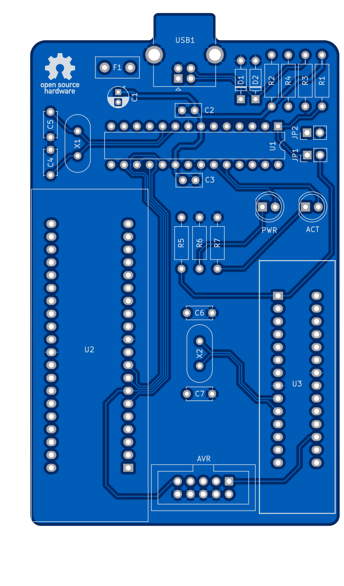

# USBasp MultiPad

[![CC BY-NC-SA 4.0][cc-by-nc-sa-shield]][cc-by-nc-sa]

### USBasp flasher for Atmega32a and Atmega328p

### Partslist
Most of the parts in this list are just examples and they can be replaced with any component with the same specs.  
They don't have to be from any specific manufacturer or brand to work on this board.

The USB breakout PCB/Daughterboard is NOT included in this repo. You will have to find one yourself.  
Pretty much any kind of breakout board that has usable VCC, GND, D+ and D- pins should work for this.  
Example: https://www.adafruit.com/product/1764

|Count|Part|Designator|Octopart URL|
|-|-|-|-|
|1|ATmega8-16pu 28-pin DIP|U1|[Atmega8-16pu](https://octopart.com/atmega8-16pu-microchip-77760540)|
|1|28 pin DIP socket (optional but highly recommended)|U1|[TE Connectivity 1-2199298-9](https://octopart.com/1-2199298-9-te+connectivity-39188588)|
|1|2x5 pin header 2.54mm (optional)|AVR|[Würth 61201021621](https://octopart.com/61201021621-w%C3%BCrth+elektronik-8917783)|
|1|USB Type-A receptacle||[Molex 67068-8000](https://octopart.com/67068-8000-molex-314304)|
|1|500 mA polyfuse|F1|[Bourns MF-R050](https://octopart.com/mf-r050-bourns-19418)|
|1|12 MHz quarz crystal|X2|[CTS ATS160](https://octopart.com/ats160-cts+components-315830)|
|1|16 MHz quarz crystal|X1|[CTS ATS120](https://octopart.com/ats120-cts+components-315826)|
|1|4.7 uF electrolytic capacitor|C1|[Panasonic ECA-1HM4R7I](https://octopart.com/eca-1hm4r7i-panasonic-39478610)|
|2|100 nF ceramic disk capacitor|C2, C3|[Kemet C315C104M5U5TA](https://octopart.com/c315c104m5u5ta-kemet-83288)|
|4|22 pF ceramic disk capacitor|C4, C5, C6, C7|[Kemet C317C220J1G5TA](https://octopart.com/c317c220j1g5ta-kemet-1747641)|
|2|10 kΩ resistor|R2, R5|[Multicomp MF25 10k](https://octopart.com/mf25+10k-multicomp-2697429)|
|2|68 Ω resistor|R3, R4|[Multicomp MF25 68R](https://octopart.com/mf25+68r-multicomp-5364489)|
|3|1.5 kΩ resistor|R1, R6, R7|[Multicomp MF25 1k5](https://octopart.com/mf25+1k5-multicomp-5372506)|
|2|5mm LEDs|ACT, PWR|[Vishay TLHG5400](https://octopart.com/tlhg5400-vishay-39403037)|
|2|3.6 V zener diode (DO-35 BZX55C3V6)|D1, D2|[ON Semiconductor BZX85C3V6](https://octopart.com/bzx85c3v6-on+semiconductor-84409073)|
|1|40-pin ZIF socket (15.24mm row spacing)|U2|3M Textool 240-3345 (or equivalent)|
|1|28-pin ZIF socket (7.62mm row spacing)|U3|3M Textool 228-3341 (or equivalent)|

### PCB preview

This work is licensed under a
[Creative Commons Attribution-NonCommercial-ShareAlike 4.0 International License][cc-by-nc-sa].

[![CC BY-NC-SA 4.0][cc-by-nc-sa-image]][cc-by-nc-sa]

[cc-by-nc-sa]: http://creativecommons.org/licenses/by-nc-sa/4.0/
[cc-by-nc-sa-image]: https://licensebuttons.net/l/by-nc-sa/4.0/88x31.png
[cc-by-nc-sa-shield]: https://img.shields.io/badge/License-CC%20BY--NC--SA%204.0-lightgrey.svg
